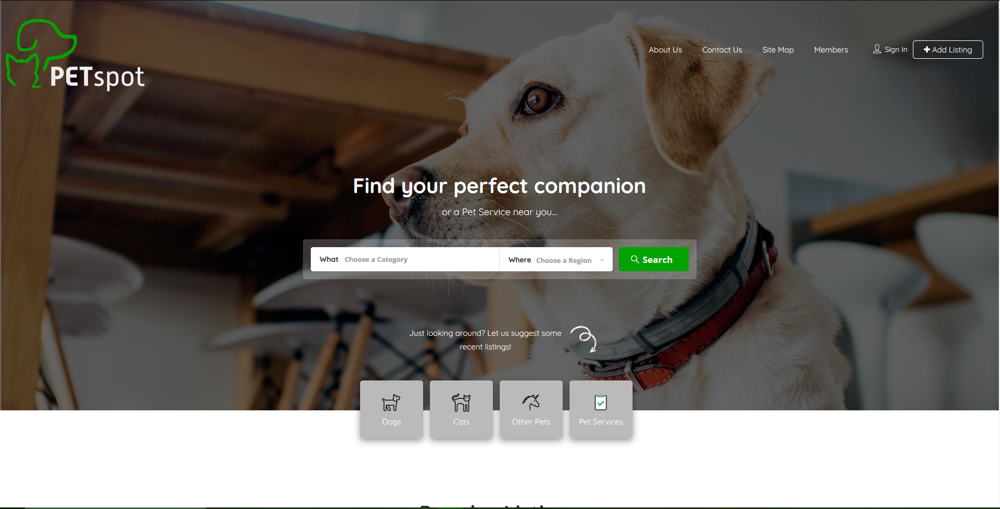
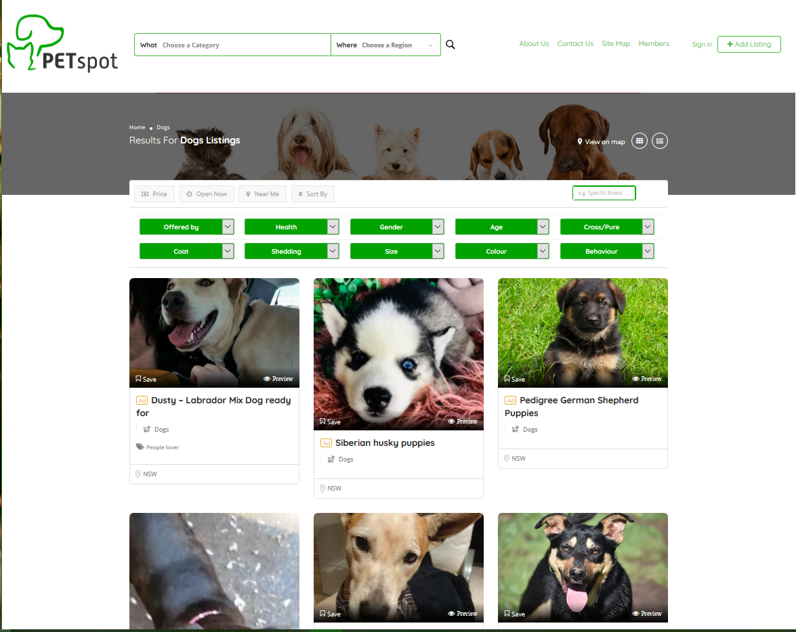
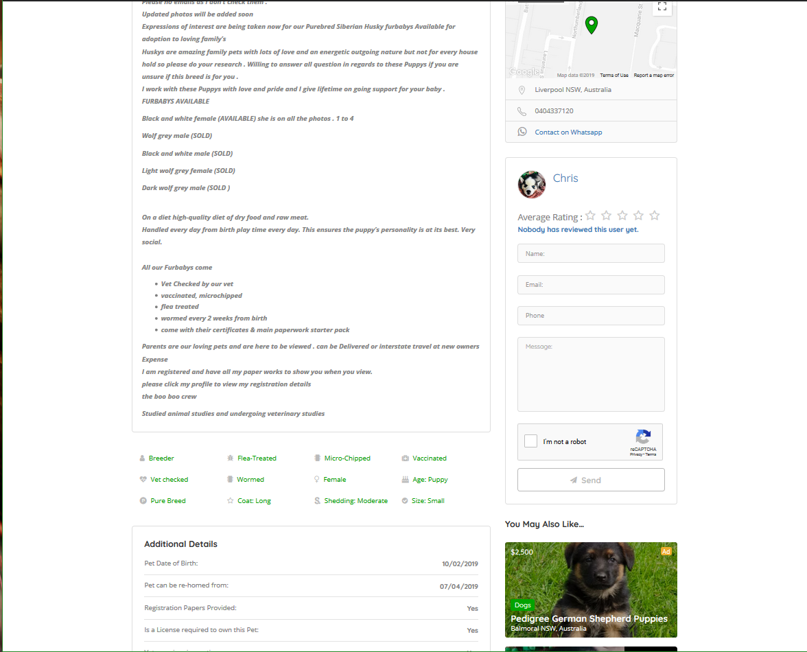

# PetSpot-Certification
Create Petspot Website on AWS platform - https://thepetspot.com.au - Certification of development provided in this repository

## IT Lead Developer Intern

#### • Developing website and adding new features. 
#### • Using Amazon Web Services to migrate website to EC2 and using CloudFront. 
#### • Programming on PHP Server, Ajax and jQuery. 
#### • Collaborating with clients and provide them IT support. 
#### • Manage intern’s work and help them program.

## Website Snips

#### Front Page

#### Listing Page

#### Listing Details Page
#### and Many more
